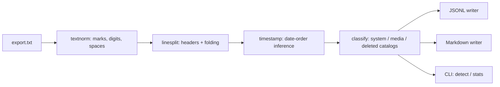

# chatcarve

[English](README.md) | [中文](README.zh.md) | [日本語](README.ja.md)

[](LICENSE) [](CHANGELOG.md) [](pyproject.toml)  [](CONTRIBUTING.md)

**オープンソースの WhatsApp チャットエクスポート・パーサー：クリーンな JSONL と Markdown を出力し、メディアリンクを保持——タイムスタンプとシステムメッセージを en-US だけでなく多くのロケールで処理。**


```bash
git clone https://github.com/JaydenCJ/chatcarve && cd chatcarve && pip install -e .
```

> **プレリリース：** chatcarve はまだ PyPI に公開されていません。初回リリースまでは [JaydenCJ/chatcarve](https://github.com/JaydenCJ/chatcarve) をクローンし、リポジトリのルートで `pip install -e .` を実行してください。ランタイム依存ゼロ——クローンだけでも動きます（`PYTHONPATH=src python3 -m chatcarve …`）。

## なぜ chatcarve？

WhatsApp のエクスポートには何十年分もの家族の歴史が眠っていますが、この `.txt` 形式はロケールに対して極めて不親切です：日付の順序、時計の方式、午前/午後の表記、不可視の方向制御文字、そしてすべてのシステムメッセージの文言が、スマホの言語設定で変わります。世の中のパーサーのほぼすべて——多くの gist やライブラリも含めて——は単一の方言を決め打ちしており、ドイツ語・韓国語・アラビア語のエクスポートは、日付がずれたり、システム通知が偽の「メッセージ」になったり、何も解析できなかったりします。chatcarve はこの形式を*構造的に*解析し、ファイル自身の証拠から日付順序を推論して（どの証拠かも報告し）、13 言語のカタログと凍結されたゴールデンファイル・コーパスでシステム行とメディア行を分類します。黙って推測せず、外部に何も送信しません：ネットワークなし、テレメトリなし、データはマシンから出ません。

|  | chatcarve | whatstk | whatsapp-chat-parser | 使い捨て正規表現 gist |
|---|---|---|---|---|
| 日付順序の推論 | ファイル全体、証拠を報告 | ファイル単位の自動または手動ヒント | 先頭数行から仮定 | ハードコード |
| 前置の午前/午後（오후/下午/午後） | 対応 | 非対応 | 非対応 | 非対応 |
| システムメッセージ | 正規化イベント、13 言語 | 破棄または誤帰属 | 英語ヒューリスティック | たいてい偽メッセージ化 |
| メディア参照 | ファイル名 + 種別 + 省略フラグ、Markdown でリンク化 | 部分的 | 対応（英語マーカー中心） | たいてい消失 |
| ロケール・テストコーパス | 15 のゴールデンフィクスチャ、en-US → ko-KR | なし | なし | なし |
| ランタイム依存 | 0 | pandas + さらに 8 個 | 0（JS） | 該当なし |

<sub>依存数は 2026-07 時点で各プロジェクトが宣言するランタイム要件：whatstk 0.6.x は pandas と他 8 パッケージに依存；whatsapp-chat-parser は JavaScript ライブラリで Python パイプラインでは使えません。chatcarve の依存数は [pyproject.toml](pyproject.toml) の `dependencies = []` です。</sub>

## 特長

- **両プラットフォームの方言に対応** —— Android（`12/31/23, 8:03 PM - …`）と iOS（`[14/02/2024, 09:15:03] …`）のヘッダー、複数行メッセージ、CRLF、BOM、そして実際のエクスポートに散りばめられた U+200E/U+200F マーク。
- **ロケール耐性のあるタイムスタンプ** —— `/`・`.`・`-` と韓国式のスペース付きドット日付；12/24 時間制；時刻の前*または*後の午前/午後トークン（`PM`、`p. m.`、`م`、`오후`、`下午`、`μ.μ.`）；U+202F/U+00A0 スペース；アラビア・インド数字。
- **証拠ベースの日付順序推論** —— `03/04/24` は行単位では曖昧でもファイル単位ではまれ；chatcarve は 4 桁の年、12 を超える日フィールド、チャットの時系列を使い、どの規則が効いたかを報告し、本当に曖昧なファイルには `--order` を受け付けます。
- **システムメッセージをノイズではなくデータに** —— 13 言語の「Alice added Bob」を正規イベント（`member_added`、`e2e_encrypted`、`missed_voice_call` など）へマッピング；未知のロケールは原文を保持したまま `event: "unknown"` に降格し、偽のチャットメッセージには決してなりません。
- **メディアリンクを保持** —— 3 種のプレースホルダー形態（`<Media omitted>`、`IMG-….jpg (file attached)`、`<attached: …>`）をロケール横断で認識；ファイル名は JSONL に残り、`--media-dir` で Markdown 内の実リンク/埋め込みになります。
- **クリーンで安定した出力** —— キーがソートされ全キーが常に存在するスキーマの JSONL（[docs/output-format.md](docs/output-format.md)）と、日付ごとにグループ化されコンテンツがエスケープされた読みやすい Markdown アーカイブ。

## クイックスタート

インストール（またはクローンをそのまま使用、依存ゼロ）：

```bash
git clone https://github.com/JaydenCJ/chatcarve && cd chatcarve && pip install -e .
```

まずエクスポートがどの方言かを chatcarve に聞いてみます：

```bash
chatcarve detect examples/family-trip.txt
```

```text
platform:       ios
date order:     dmy (day-over-12)
clock:          24-hour
seconds:        yes
messages:       11
```

JSONL に彫り出します（1 行 1 メッセージ、ここでは出力を省略）：

```bash
chatcarve parse examples/family-trip.txt | head -4
```

```text
{"author": null, "index": 0, "kind": "system", "line": 1, "media": null, "raw_timestamp": "30/08/2024, 10:12:45", "system": {"event": "e2e_encrypted"}, "text": "Messages and calls are end-to-end encrypted. ...", "timestamp": "2024-08-30T10:12:45"}
{"author": null, "index": 1, "kind": "system", "line": 2, "media": null, "raw_timestamp": "30/08/2024, 10:12:45", "system": {"event": "group_created"}, "text": "Nan created group \"Trip to the seaside\"", "timestamp": "2024-08-30T10:12:45"}
{"author": null, "index": 2, "kind": "system", "line": 3, "media": null, "raw_timestamp": "30/08/2024, 10:13:02", "system": {"event": "member_added"}, "text": "Nan added Dev", "timestamp": "2024-08-30T10:13:02"}
{"author": "Dev", "index": 3, "kind": "text", "line": 4, "media": null, "raw_timestamp": "30/08/2024, 10:15:11", "system": null, "text": "Right, who's driving?", "timestamp": "2024-08-30T10:15:11"}
```

あるいは動くメディアリンク付きの Markdown アーカイブと、サマリーに：

```bash
chatcarve parse examples/family-trip.txt --markdown trip.md --media-dir media
chatcarve stats examples/family-trip.txt
```

```text
messages:  11
kinds:     4 text, 2 media, 4 system, 1 deleted
range:     2024-08-30T10:12:45 .. 2024-08-31T18:22:05
authors:
  Dev  4
  Nan  3
```

同じコマンドが [`tests/corpus/`](tests/corpus/) の 15 のロケールフィクスチャを処理します——韓国語の前置午前/午後も含めて：`"raw_timestamp": "2023. 12. 31. 오후 11:58:02"` は `"timestamp": "2023-12-31T23:58:02"` になります。Python API（`parse_chat`、`render_jsonl`、`render_markdown`）のデモは [`examples/carve_demo.py`](examples/carve_demo.py) にあります。

## CLI リファレンス

| コマンド / フラグ | デフォルト | 効果 |
|---|---|---|
| `parse <export>` | JSONL を stdout へ | エクスポートを変換；`-` で stdin を読む |
| `--jsonl PATH` | `-`（stdout） | JSONL をファイルへ書き出す |
| `--markdown PATH` | オフ | 日付ごとの Markdown アーカイブも出力 |
| `--media-dir DIR` | `.` | Markdown のメディアリンクが指すディレクトリ |
| `--title TEXT` | エクスポートのファイル名 | Markdown ドキュメントのタイトル |
| `--order dmy\|mdy\|ymd` | 自動推論 | 曖昧なファイルに日付順序を強制する |
| `detect <export>` | — | プラットフォーム、日付順序と証拠、時計方式を報告 |
| `stats <export>` | — | 作者、種別、日付範囲 |

終了コード：`0` 成功、`1` メッセージなし（エクスポートではない）、`2` 使い方または I/O エラー。ロケール対応——どの言語、どの罠、推論が証拠をどう順位付けするか——は [docs/locale-support.md](docs/locale-support.md) に記載しています。

## 検証

このリポジトリは CI を持ちません；上記の主張はすべてローカル実行で検証されています。このリポジトリのチェックアウトから再現できます：

```bash
pip install -e '.[dev]' && pytest && bash scripts/smoke.sh
```

出力（実際の実行からコピー、`...` で省略）：

```text
89 passed in 0.32s
...
[stats] kinds:     4 text, 2 media, 4 system, 1 deleted
SMOKE OK
```

## アーキテクチャ



## ロードマップ

- [x] 構造的な 2 方言パーサー、証拠ベースの日付順序推論、13 言語のシステム/メディア/削除トゥームストーン・カタログ、JSONL + Markdown ライター、15 フィクスチャのゴールデンコーパス、CLI（v0.1.0）
- [ ] PyPI 公開（`pip install chatcarve`）
- [ ] カタログとコーパスのロケール追加（hi、id、pl、th、vi——貢献歓迎）
- [ ] エクスポートに含まれる場合の引用返信・編集済みメッセージ注釈
- [ ] インラインサムネイル付き HTML アーカイブライター
- [ ] 同じ JSONL スキーマを出力する Telegram / Signal エクスポート・フロントエンド

全リストは [open issues](https://github.com/JaydenCJ/chatcarve/issues) を参照してください。

## コントリビュート

貢献を歓迎します——とりわけロケールフィクスチャ；言語の追加はパターンテーブルとコーパスファイルだけで済みます。[good first issue](https://github.com/JaydenCJ/chatcarve/issues?q=is%3Aissue+is%3Aopen+label%3A%22good+first+issue%22) から始めるか、[discussion](https://github.com/JaydenCJ/chatcarve/discussions) を開いてください。開発環境のセットアップは [CONTRIBUTING.md](CONTRIBUTING.md) を参照してください。

## ライセンス

[MIT](LICENSE)
