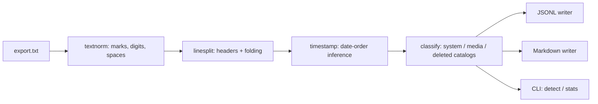

# chatcarve

[English](README.md) | [中文](README.zh.md) | [日本語](README.ja.md)

[](LICENSE) [](CHANGELOG.md) [](pyproject.toml)  [](CONTRIBUTING.md)

**Open-source WhatsApp chat-export parser: clean JSONL and Markdown out, media links preserved — timestamps and system messages handled across locales, not just en-US.**


```bash
git clone https://github.com/JaydenCJ/chatcarve && cd chatcarve && pip install -e .
```

> **Pre-release:** chatcarve is not yet published to PyPI. Until the first release, clone [JaydenCJ/chatcarve](https://github.com/JaydenCJ/chatcarve) and run `pip install -e .` from the repository root. Zero runtime dependencies — the clone alone is enough (`PYTHONPATH=src python3 -m chatcarve …`).

## Why chatcarve?

People sit on a decade of family history inside WhatsApp exports, and the `.txt` format is locale-hostile: the date order, the clock convention, the meridiem token, the invisible direction marks, and the wording of every system message all change with the phone's language. Nearly every parser you will find — including most gists and libraries — hardcodes one dialect, so a German, Korean, or Arabic export silently produces shifted dates, fake "messages" that are really system notices, or nothing at all. chatcarve parses the format *structurally*, infers the date order from evidence in the file itself (and tells you which evidence), and classifies system and media lines against a 13-language catalog backed by a frozen golden-file corpus. It never guesses silently and never phones home: no network, no telemetry, nothing leaves your machine.

|  | chatcarve | whatstk | whatsapp-chat-parser | one-off regex gists |
|---|---|---|---|---|
| Date-order inference | Whole-file, with reported evidence | Per-file auto or manual hint | Assumes from first lines | Hardcoded |
| Prefix meridiems (오후/下午/午後) | Yes | No | No | No |
| System messages | Canonical events, 13 languages | Dropped or misattributed | English heuristics | Usually become fake messages |
| Media references | Filename + type + omitted flag, linked in Markdown | Partial | Yes (en-centric markers) | Usually lost |
| Locale test corpus | 15 golden fixtures, en-US → ko-KR | No | No | No |
| Runtime dependencies | 0 | pandas + 8 more | 0 (JS) | n/a |

<sub>Dependency counts are the declared runtime requirements as of 2026-07: whatstk 0.6.x depends on pandas and 8 further packages; whatsapp-chat-parser is a JavaScript library, not usable from Python pipelines. chatcarve's count is `dependencies = []` in [pyproject.toml](pyproject.toml).</sub>

## Features

- **Both platform dialects** — Android (`12/31/23, 8:03 PM - …`) and iOS (`[14/02/2024, 09:15:03] …`) headers, multi-line messages, CRLF, BOM, and the U+200E/U+200F marks real exports are littered with.
- **Locale-tolerant timestamps** — `/`, `.`, `-` and Korean spaced-dot dates; 12/24-hour clocks; meridiem tokens before *or* after the time (`PM`, `p. m.`, `م`, `오후`, `下午`, `μ.μ.`); U+202F/U+00A0 spaces; Arabic-Indic digits.
- **Evidence-based date-order inference** — `03/04/24` is ambiguous per line but rarely per file; chatcarve uses four-digit years, day>12 fields, and chat chronology, reports which rule fired, and takes `--order` when a file is genuinely ambiguous.
- **System messages become data, not noise** — "Alice added Bob" in 13 languages maps to canonical events (`member_added`, `e2e_encrypted`, `missed_voice_call`, …); unknown locales degrade to `event: "unknown"` with the text preserved, never to a fake chat message.
- **Media links preserved** — all three placeholder shapes (`<Media omitted>`, `IMG-….jpg (file attached)`, `<attached: …>`) are recognized across locales; filenames survive into JSONL and become real links/embeds in Markdown via `--media-dir`.
- **Clean, stable outputs** — JSONL with sorted keys and an all-keys-always-present schema ([docs/output-format.md](docs/output-format.md)), and a readable day-grouped Markdown archive with escaped content.

## Quickstart

Install (or just use the clone, zero dependencies):

```bash
git clone https://github.com/JaydenCJ/chatcarve && cd chatcarve && pip install -e .
```

Ask chatcarve what dialect an export speaks:

```bash
chatcarve detect examples/family-trip.txt
```

```text
platform:       ios
date order:     dmy (day-over-12)
clock:          24-hour
seconds:        yes
messages:       11
```

Carve it into JSONL (one message per line, output truncated here):

```bash
chatcarve parse examples/family-trip.txt | head -4
```

```text
{"author": null, "index": 0, "kind": "system", "line": 1, "media": null, "raw_timestamp": "30/08/2024, 10:12:45", "system": {"event": "e2e_encrypted"}, "text": "Messages and calls are end-to-end encrypted. ...", "timestamp": "2024-08-30T10:12:45"}
{"author": null, "index": 1, "kind": "system", "line": 2, "media": null, "raw_timestamp": "30/08/2024, 10:12:45", "system": {"event": "group_created"}, "text": "Nan created group \"Trip to the seaside\"", "timestamp": "2024-08-30T10:12:45"}
{"author": null, "index": 2, "kind": "system", "line": 3, "media": null, "raw_timestamp": "30/08/2024, 10:13:02", "system": {"event": "member_added"}, "text": "Nan added Dev", "timestamp": "2024-08-30T10:13:02"}
{"author": "Dev", "index": 3, "kind": "text", "line": 4, "media": null, "raw_timestamp": "30/08/2024, 10:15:11", "system": null, "text": "Right, who's driving?", "timestamp": "2024-08-30T10:15:11"}
```

Or into a Markdown archive with working media links, plus a summary:

```bash
chatcarve parse examples/family-trip.txt --markdown trip.md --media-dir media
chatcarve stats examples/family-trip.txt
```

```text
messages:  11
kinds:     4 text, 2 media, 4 system, 1 deleted
range:     2024-08-30T10:12:45 .. 2024-08-31T18:22:05
authors:
  Dev  4
  Nan  3
```

The same commands handle the fifteen locale fixtures in [`tests/corpus/`](tests/corpus/) — Korean prefix meridiems included: `"raw_timestamp": "2023. 12. 31. 오후 11:58:02"` becomes `"timestamp": "2023-12-31T23:58:02"`. The Python API (`parse_chat`, `render_jsonl`, `render_markdown`) is demonstrated in [`examples/carve_demo.py`](examples/carve_demo.py).

## CLI reference

| Command / flag | Default | Effect |
|---|---|---|
| `parse <export>` | JSONL to stdout | convert an export; `-` reads stdin |
| `--jsonl PATH` | `-` (stdout) | write JSONL to a file |
| `--markdown PATH` | off | also write a day-grouped Markdown archive |
| `--media-dir DIR` | `.` | directory Markdown media links point into |
| `--title TEXT` | export file name | Markdown document title |
| `--order dmy\|mdy\|ymd` | inferred | force the date order for ambiguous files |
| `detect <export>` | — | report platform, date order + evidence, clock |
| `stats <export>` | — | authors, kinds, date range |

Exit codes: `0` success, `1` no messages found (not an export), `2` usage or I/O error. Locale coverage — which languages, which hazards, how inference ranks evidence — is documented in [docs/locale-support.md](docs/locale-support.md).

## Verification

This repository ships no CI; every claim above is verified by local runs. Reproduce them from a checkout of this repository:

```bash
pip install -e '.[dev]' && pytest && bash scripts/smoke.sh
```

Output (copied from a real run, truncated with `...`):

```text
89 passed in 0.32s
...
[stats] kinds:     4 text, 2 media, 4 system, 1 deleted
SMOKE OK
```

## Architecture



## Roadmap

- [x] Structural two-dialect parser, evidence-based date-order inference, 13-language system/media/tombstone catalogs, JSONL + Markdown writers, 15-fixture golden corpus, CLI (v0.1.0)
- [ ] PyPI release with `pip install chatcarve`
- [ ] More locales in catalog and corpus (hi, id, pl, th, vi — contributions welcome)
- [ ] Quoted-reply and edited-message annotations where exports carry them
- [ ] HTML archive writer with inline thumbnails
- [ ] Telegram and Signal export front-ends emitting the same JSONL schema

See the [open issues](https://github.com/JaydenCJ/chatcarve/issues) for the full list.

## Contributing

Contributions are welcome — locale fixtures most of all; adding a language touches only pattern tables and a corpus file. Start with a [good first issue](https://github.com/JaydenCJ/chatcarve/issues?q=is%3Aissue+is%3Aopen+label%3A%22good+first+issue%22) or open a [discussion](https://github.com/JaydenCJ/chatcarve/discussions). See [CONTRIBUTING.md](CONTRIBUTING.md) for the development setup.

## License

[MIT](LICENSE)
