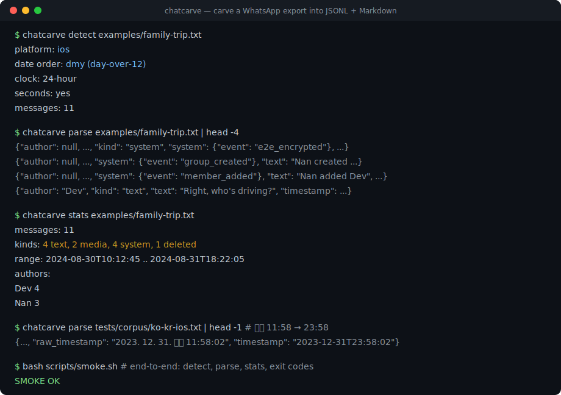
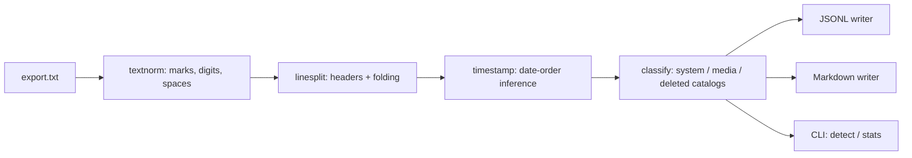

# chatcarve

[English](README.md) | [中文](README.zh.md) | [日本語](README.ja.md)

[](LICENSE) [](CHANGELOG.md) [](pyproject.toml)  [](CONTRIBUTING.md)

**开源的 WhatsApp 聊天记录导出解析器：输出干净的 JSONL 与 Markdown，媒体链接完整保留——时间戳和系统消息支持多语言环境，而不只是 en-US。**



```bash
git clone https://github.com/JaydenCJ/chatcarve && cd chatcarve && pip install -e .
```

> **预发布：** chatcarve 尚未发布到 PyPI。在首个正式版之前，请克隆 [JaydenCJ/chatcarve](https://github.com/JaydenCJ/chatcarve) 并在仓库根目录运行 `pip install -e .`。零运行时依赖——只要有克隆就够了（`PYTHONPATH=src python3 -m chatcarve …`）。

## 为什么选 chatcarve？

无数人的十几年家庭记忆都躺在 WhatsApp 导出文件里，而这个 `.txt` 格式对语言环境极不友好：日期顺序、时钟制式、上午/下午标记、不可见的方向控制符，以及每条系统消息的措辞，都会随手机语言而变化。你能找到的几乎所有解析器——包括大多数 gist 和库——都硬编码了单一方言，于是德语、韩语或阿拉伯语的导出会悄悄产生偏移的日期、把系统通知当成假"消息"，甚至什么都解析不出来。chatcarve 从*结构*上解析该格式，依据文件自身的证据推断日期顺序（并告诉你依据是什么），再用覆盖 13 种语言、有冻结黄金文件语料库背书的目录对系统与媒体行进行分类。它绝不静默猜测，也绝不回传数据：无网络、无遥测，任何内容都不会离开你的机器。

|  | chatcarve | whatstk | whatsapp-chat-parser | 一次性正则 gist |
|---|---|---|---|---|
| 日期顺序推断 | 全文件级，并报告证据 | 按文件自动或手动提示 | 只看开头几行 | 硬编码 |
| 前置上午/下午（오후/下午/午後） | 支持 | 不支持 | 不支持 | 不支持 |
| 系统消息 | 规范化事件，13 种语言 | 丢弃或误归属 | 英文启发式 | 通常变成假消息 |
| 媒体引用 | 文件名 + 类型 + 省略标志，Markdown 中成链接 | 部分支持 | 支持（以英文标记为中心） | 通常丢失 |
| 多语言测试语料库 | 15 个黄金 fixture，en-US → ko-KR | 无 | 无 | 无 |
| 运行时依赖 | 0 | pandas + 另外 8 个 | 0（JS） | 不适用 |

<sub>依赖数为 2026-07 时各项目声明的运行时依赖：whatstk 0.6.x 依赖 pandas 及另外 8 个包；whatsapp-chat-parser 是 JavaScript 库，无法用于 Python 流水线。chatcarve 的依赖数即 [pyproject.toml](pyproject.toml) 中的 `dependencies = []`。</sub>

## 特性

- **两大平台方言全覆盖** —— Android（`12/31/23, 8:03 PM - …`）与 iOS（`[14/02/2024, 09:15:03] …`）两种消息头、多行消息、CRLF、BOM，以及真实导出中随处可见的 U+200E/U+200F 标记。
- **容忍各种语言环境的时间戳** —— `/`、`.`、`-` 及韩式带空格点号日期；12/24 小时制；时间前*或*后的上午/下午标记（`PM`、`p. m.`、`م`、`오후`、`下午`、`μ.μ.`）；U+202F/U+00A0 空格；阿拉伯-印度数字。
- **基于证据的日期顺序推断** —— `03/04/24` 单行有歧义，但整个文件很少有；chatcarve 利用四位年份、大于 12 的日字段和聊天时间顺序，报告命中的规则，文件确实有歧义时可用 `--order` 指定。
- **系统消息变成数据而非噪音** —— 13 种语言的"Alice added Bob"映射为规范事件（`member_added`、`e2e_encrypted`、`missed_voice_call` 等）；未知语言降级为 `event: "unknown"` 并保留原文，绝不变成假聊天消息。
- **媒体链接完整保留** —— 三种占位符形态（`<Media omitted>`、`IMG-….jpg (file attached)`、`<attached: …>`）跨语言识别；文件名进入 JSONL，并经 `--media-dir` 在 Markdown 中变成真实链接/内嵌图片。
- **干净稳定的输出** —— JSONL 键排序、所有键恒定存在的模式（[docs/output-format.md](docs/output-format.md)），以及按天分组、内容已转义的可读 Markdown 档案。

## 快速上手

安装（或直接用克隆，零依赖）：

```bash
git clone https://github.com/JaydenCJ/chatcarve && cd chatcarve && pip install -e .
```

先问问 chatcarve 这个导出说的是哪种方言：

```bash
chatcarve detect examples/family-trip.txt
```

```text
platform:       ios
date order:     dmy (day-over-12)
clock:          24-hour
seconds:        yes
messages:       11
```

把它雕成 JSONL（每行一条消息，此处输出有截断）：

```bash
chatcarve parse examples/family-trip.txt | head -4
```

```text
{"author": null, "index": 0, "kind": "system", "line": 1, "media": null, "raw_timestamp": "30/08/2024, 10:12:45", "system": {"event": "e2e_encrypted"}, "text": "Messages and calls are end-to-end encrypted. ...", "timestamp": "2024-08-30T10:12:45"}
{"author": null, "index": 1, "kind": "system", "line": 2, "media": null, "raw_timestamp": "30/08/2024, 10:12:45", "system": {"event": "group_created"}, "text": "Nan created group \"Trip to the seaside\"", "timestamp": "2024-08-30T10:12:45"}
{"author": null, "index": 2, "kind": "system", "line": 3, "media": null, "raw_timestamp": "30/08/2024, 10:13:02", "system": {"event": "member_added"}, "text": "Nan added Dev", "timestamp": "2024-08-30T10:13:02"}
{"author": "Dev", "index": 3, "kind": "text", "line": 4, "media": null, "raw_timestamp": "30/08/2024, 10:15:11", "system": null, "text": "Right, who's driving?", "timestamp": "2024-08-30T10:15:11"}
```

或者雕成带可用媒体链接的 Markdown 档案，外加一份摘要：

```bash
chatcarve parse examples/family-trip.txt --markdown trip.md --media-dir media
chatcarve stats examples/family-trip.txt
```

```text
messages:  11
kinds:     4 text, 2 media, 4 system, 1 deleted
range:     2024-08-30T10:12:45 .. 2024-08-31T18:22:05
authors:
  Dev  4
  Nan  3
```

同样的命令可以处理 [`tests/corpus/`](tests/corpus/) 里的十五个语言 fixture——包括韩语前置上午/下午：`"raw_timestamp": "2023. 12. 31. 오후 11:58:02"` 变成 `"timestamp": "2023-12-31T23:58:02"`。Python API（`parse_chat`、`render_jsonl`、`render_markdown`）的演示见 [`examples/carve_demo.py`](examples/carve_demo.py)。

## CLI 参考

| 命令 / 选项 | 默认值 | 作用 |
|---|---|---|
| `parse <export>` | JSONL 到 stdout | 转换一个导出文件；`-` 表示读 stdin |
| `--jsonl PATH` | `-`（stdout） | 把 JSONL 写入文件 |
| `--markdown PATH` | 关闭 | 同时输出按天分组的 Markdown 档案 |
| `--media-dir DIR` | `.` | Markdown 媒体链接指向的目录 |
| `--title TEXT` | 导出文件名 | Markdown 文档标题 |
| `--order dmy\|mdy\|ymd` | 自动推断 | 为有歧义的文件强制指定日期顺序 |
| `detect <export>` | — | 报告平台、日期顺序及证据、时钟制式 |
| `stats <export>` | — | 作者、消息类型、日期范围 |

退出码：`0` 成功，`1` 未找到消息（不是导出文件），`2` 用法或 I/O 错误。语言覆盖情况——支持哪些语言、哪些陷阱、推断如何排序证据——见 [docs/locale-support.md](docs/locale-support.md)。

## 验证

本仓库不携带 CI；上面每一条声明都由本地运行验证。在本仓库的检出中即可复现：

```bash
pip install -e '.[dev]' && pytest && bash scripts/smoke.sh
```

输出（摘自真实运行，用 `...` 截断）：

```text
89 passed in 0.32s
...
[stats] kinds:     4 text, 2 media, 4 system, 1 deleted
SMOKE OK
```

## 架构



## 路线图

- [x] 结构化双方言解析器、基于证据的日期顺序推断、13 种语言的系统/媒体/删除墓碑目录、JSONL + Markdown 输出、15 个 fixture 的黄金语料库、CLI（v0.1.0）
- [ ] 发布到 PyPI，支持 `pip install chatcarve`
- [ ] 目录与语料库覆盖更多语言（hi、id、pl、th、vi——欢迎贡献）
- [ ] 在导出携带时解析引用回复与已编辑消息标注
- [ ] 带内联缩略图的 HTML 档案输出
- [ ] Telegram 与 Signal 导出前端，输出同一 JSONL 模式

完整列表见 [open issues](https://github.com/JaydenCJ/chatcarve/issues)。

## 贡献

欢迎贡献——尤其是语言 fixture；新增一种语言只需改动模式表和一个语料文件。可以从 [good first issue](https://github.com/JaydenCJ/chatcarve/issues?q=is%3Aissue+is%3Aopen+label%3A%22good+first+issue%22) 入手，或发起一个 [discussion](https://github.com/JaydenCJ/chatcarve/discussions)。开发环境搭建见 [CONTRIBUTING.md](CONTRIBUTING.md)。

## 许可证

[MIT](LICENSE)
